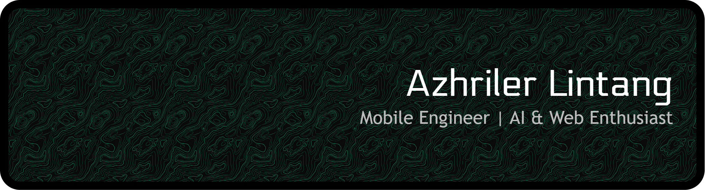

<p align="center">
  
</p>

<h1 align="center">
  
</h1>

<p align="center">
  
  
</p>

---

## 🚀 About Me

🎯 **Mobile Engineer** | 💻 **AI & Web Enthusiast** | 🌟 **Tech Explorer**

- 🔭 I'm currently working on **mobile applications and AI-powered solutions**
- 🌱 I'm constantly learning **React Native, Flutter, and Machine Learning**
- 👯 I'm looking to collaborate on **innovative mobile and web projects**
- 💬 Ask me about **Mobile Development, AI, Web Technologies, and Cloud Solutions**
- 📫 How to reach me: **azhrielazazel@gmail.com**
- ⚡ Fun fact: **I turn coffee into code and bugs into features! ☕️**

---

## 🛠️ Tech Stack

### Languages

<p align="left">
  
  
  
  
  
  
  
</p>

### Frameworks & Libraries

<p align="left">
  
  
  
  
  
  
  
</p>

### Databases

<p align="left">
  
  
  
  
  
</p>

### Tools & Platforms

<p align="left">
  
  
  
  
  
  
</p>

---

## 📊 GitHub Statistics

<p align="center">
  
  
</p>

<p align="center">
  
</p>

---

## 📈 Activity Graph

<p align="center">
  
</p>

---

## 🎮 Contribution Pac-Man

<p align="center">
  
</p>

---

## 💻 Most Used Languages

```text
JavaScript   ████████████░░░░░░░░░   55.2%
Python       ██████░░░░░░░░░░░░░░░   25.8%
HTML/CSS     ███░░░░░░░░░░░░░░░░░░   12.3%
TypeScript   ██░░░░░░░░░░░░░░░░░░░    5.1%
Other        █░░░░░░░░░░░░░░░░░░░░    1.6%
```

---

## 🤝 Connect with Me

<p align="center">
  <a href="https://linkedin.com/in/azhriler-lintang-6343ba234"></a>
  <a href="https://instagram.com/azhrl79"></a>
  <a href="mailto:azhrielazazel@gmail.com"></a>
  <a href="https://mayoureal.web.id"></a>
</p>

---

## 💡 Random Dev Quote

<p align="center">
  
</p>

---

<p align="center">
  
</p>
